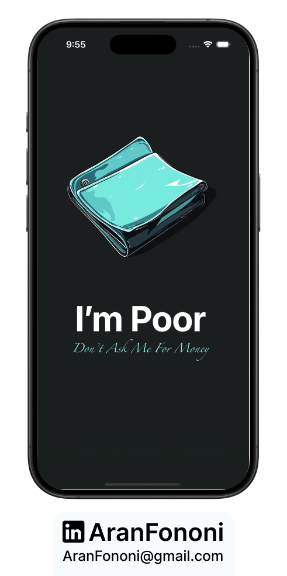
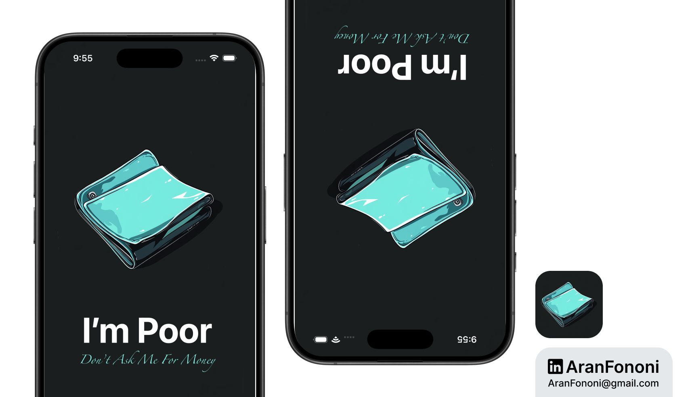

# I Am Poor

### Project for Section 3: **Building a Custom iOS App**  
This project was completed as part of Section 3 in the **Complete iOS Development Bootcamp** by Angela Yu.

## Project Overview
**I Am Poor** is a fun take on the **I Am Rich** app, inspired by a popular meme. The challenge was to create an app that humorously contrasts with the original while keeping things simple and user-friendly. I focused on making the app visually appealing without following the course template too closely.

## What I Learned
In this project, I gained insights into:
- **Basic UI Design**: Learned how to layout UI elements in a clean and straightforward manner.
- **ViewController Basics**: Got comfortable managing view controllers and understanding their role in the app.
- **Creativity in Simplicity**: Discovered the importance of a clean design and how to make an app look good while keeping it functional.

## Key Skills
- Simple UI Layout
- Understanding View Controllers
- Creative App Development

---

### Project Preview

---

### Footer

---

## Contact
For more information, feel free to reach out:  
- **Email**: [aranfononi@gmail.com](mailto:aranfononi@gmail.com)  
